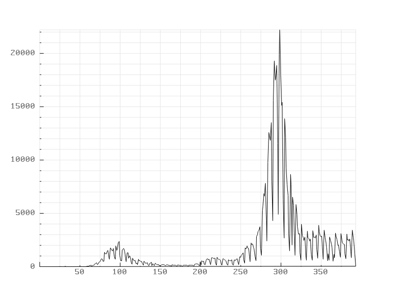
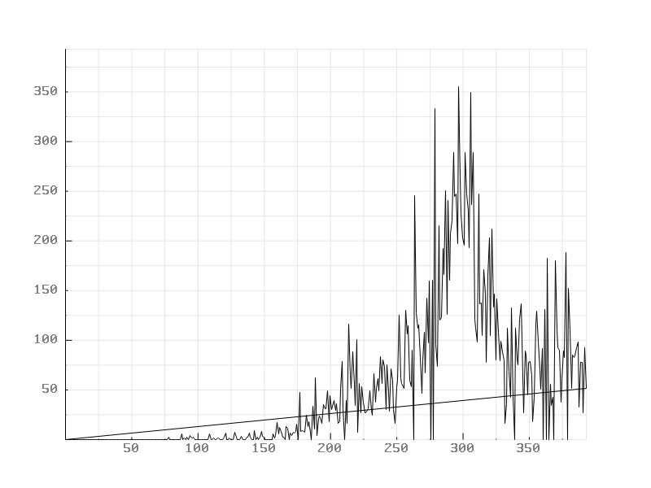
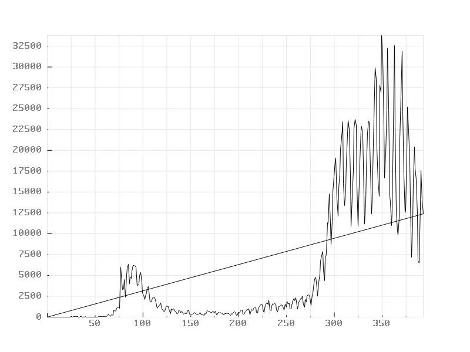
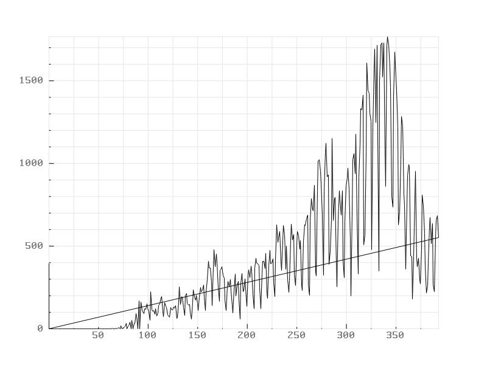
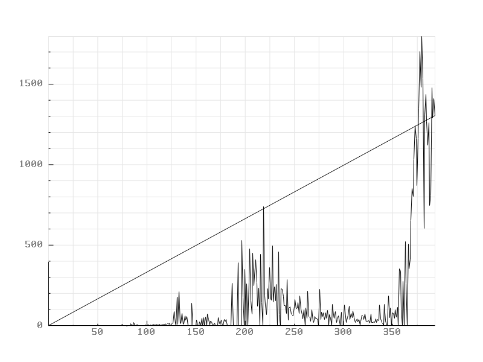

# Visualizing Corona infection data

Analyze and generate graphs based on the official WHO data in both C or Java. 

This repository is divided into two versions:

<ul>
    <li><a href="./c_version">c_version</a></li>
    <li><a href="./java_version">java_version</a></li>
</ul>

## Example diagrams:

### Java Version

| |
| --- |
|  |
|  |
|  |

### C Version

| | |
| --- | --- |
|  |  |
|  |  |
|  |  |
