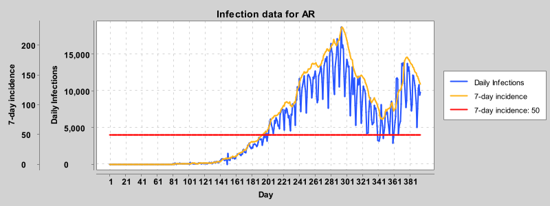

# Visualizing Corona infection data

This project showcases how to analyze and generate graphs based on the official WHO data  in both C and Java. The decision to implement this project in both C and Java allows for a comparison of procedural (C) and object-oriented (Java) programming approaches.

This repository is divided into two main directories:

<ul>
    <li><a href="./c_version">c_version</a>: Contains the implementation of the project in C.</li>
    <li><a href="./java_version">java_version</a>: Contains the implementation of the project in Java.</li>
</ul>

Each directory has its own README.md with instructions for the particular implementation.

## Example diagrams:

Here are some example diagrams generated by each version of the project:

### Java Version Diagrams
Located in `java_version/output/`:

     
     
     

### C Version Diagrams
Located in `c_version/plots/`:

     
     
     
     
     

